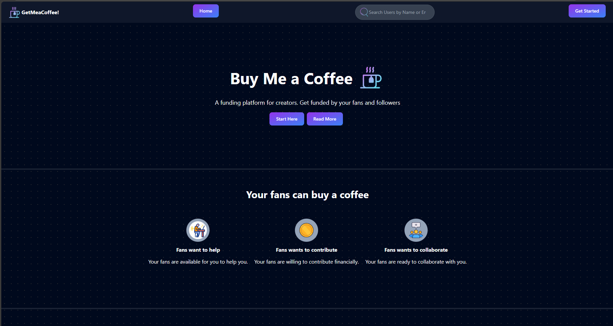

# ☕ GetMeACoffee

**GetMeACoffee** is a platform inspired by Patreon, designed to empower creators to connect with their audience and receive support. Creators can set up their profiles, share content, and receive payments seamlessly. This platform features a robust payment integration, making it easy for supporters to contribute and creators to monetize their work.

## 🖼️ Preview

[Visit the live application](https://get-mea-coffee-jzpq.vercel.app/)

## 🛠️ Features

- 🎨 **Creator Profiles**: Set up and customize your profile to showcase your work.
- 💳 **Payment Integration**: Secure payment processing using Razorpay.
- ⚡ **Real-Time Payment Page**: An interactive and live payment interface for seamless transactions.
- 🔍 **Dynamic Search**: Quickly find creators by their name or email.
- 🔑 **Authentication**: Login and signup via Google and GitHub using NextAuth.
- 📤 **Content Sharing**: Share exclusive content with your supporters.
- 🎥 **Animated Icons**: Beautiful and interactive icons powered by LordIcons.
- 🔔 **Toast Notifications**: Instant feedback using React-Toastify for actions like successful payments or errors.
- 📱 **Responsive Design**: Optimized for both desktop and mobile devices.

## 🌐 Deployed Link

Access the live application here: [GetMeACoffee](https://get-mea-coffee-jzpq.vercel.app/)

## 💻 Tech Stack

- 🖥️ **Framework**: Next.js - A React framework for building high-performance web applications.
- 🗄️ **Backend**: Node.js with MongoDB - For managing user data and transactions.
- 💰 **Payment Integration**: Razorpay - To process payments securely and efficiently.
- 🔑 **Authentication**: NextAuth - Google and GitHub-based login.
- 🎥 **Icons**: LordIcons - Animated and interactive icons.
- 🔔 **Notifications**: React-Toastify - For elegant toast notifications.
